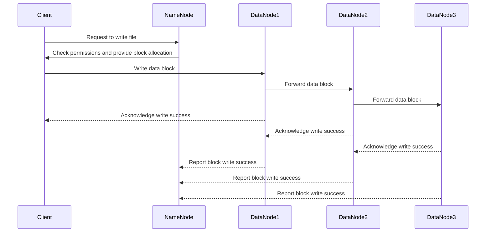
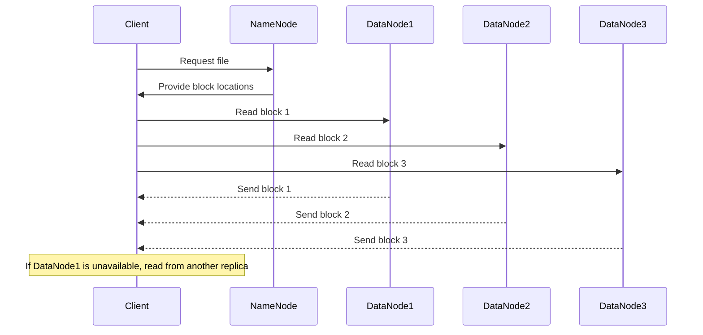
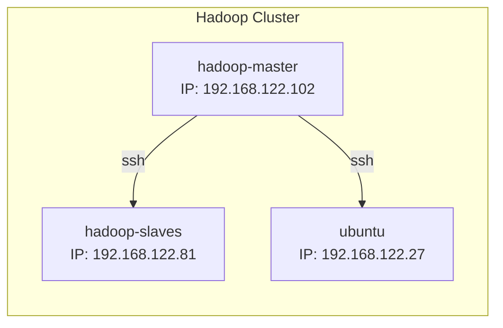
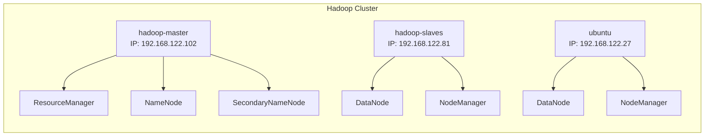

# HADOOP CLUSTER DOCUMENTATION <!-- title: Your Title -->

**Author:** Pham Tung Lam  
**Date Released:** February 11, 2025

- [HADOOP CLUSTER DOCUMENTATION ](#hadoop-cluster-documentation-)
  - [1. Hadoop Introduction:](#1-hadoop-introduction)
  - [2. HDFS Architecture Overview](#2-hdfs-architecture-overview)
    - [a. NameNode (Master)](#a-namenode-master)
    - [b. DataNode (Slave)](#b-datanode-slave)
    - [c. Secondary NameNode](#c-secondary-namenode)
  - [3. How Data is Stored in HDFS](#3-how-data-is-stored-in-hdfs)
    - [a. File to Blocks Mapping](#a-file-to-blocks-mapping)
    - [b. Block Storage Mechanism](#b-block-storage-mechanism)
    - [c. Replication Strategy](#c-replication-strategy)
  - [4. How HDFS Manages Data](#4-how-hdfs-manages-data)
    - [a. Write Process](#a-write-process)
    - [b. Read Process](#b-read-process)
    - [c. Fault Tolerance and Self-Healing](#c-fault-tolerance-and-self-healing)
  - [5. Data Storage](#5-data-storage)
    - [5.1. Metadata (FsImage \& EditLogs)](#51-metadata-fsimage--editlogs)
    - [5.2: HDFS File Types and Storage](#52-hdfs-file-types-and-storage)
  - [6. My Hadoop Cluster](#6-my-hadoop-cluster)
    - [6.1. Topology:](#61-topology)
    - [6.2. Cluster Operation:](#62-cluster-operation)
    - [6.3. What Hadoop Cluster can do:](#63-what-hadoop-cluster-can-do)
    - [6.4. Integration with Hive, Spark, and Oozie:](#64-integration-with-hive-spark-and-oozie)
    - [6.5. Cooperation between Components:](#65-cooperation-between-components)
  - [7. Some example (for Hadoop only):](#7-some-example-for-hadoop-only)
    - [7.1. Storing Data:](#71-storing-data)
    - [7.2. Run MapReduce Job:](#72-run-mapreduce-job)
    - [7.3. Run Custom MapReduce Code:](#73-run-custom-mapreduce-code)


## 1. Hadoop Introduction:

Apache Hadoop is an open-source software framework used for distributed storage and processing of large data sets using the MapReduce programming model. It is designed to scale up from a single server to thousands of machines, each offering local computation and storage. Hadoop provides a reliable, scalable, and efficient way to handle vast amounts of data, making it a popular choice for big data analytics.

Key components of Hadoop include:
- **Hadoop Distributed File System (HDFS)**: A distributed file system that stores data across multiple machines.
- **MapReduce**: A programming model for processing large data sets with a distributed algorithm.
- **YARN (Yet Another Resource Negotiator)**: A resource management layer for scheduling and managing cluster resources.
- **Hadoop Common**: The common utilities and libraries that support other Hadoop modules.

## 2. HDFS Architecture Overview

HDFS has three main components:

### a. NameNode (Master)
Manages the metadata (file namespace, directory structure, block mapping).
Tracks where each block of a file is stored within the cluster.
Handles file system operations (create, delete, rename, permissions).
Stores metadata in memory for fast access and persists it in the FsImage and EditLogs.
### b. DataNode (Slave)
Stores actual data blocks of files.
Periodically sends heartbeat and block reports to the NameNode.
Performs read/write operations requested by clients.
Handles replication of data blocks to ensure fault tolerance.
### c. Secondary NameNode
It is not a backup for the NameNode but helps by periodically merging the EditLogs into FsImage to reduce metadata load.

## 3. How Data is Stored in HDFS

### a. File to Blocks Mapping
When a file is written to HDFS, it is split into fixed-size blocks (default 128MB or 256MB in modern Hadoop versions).
Each block is stored across multiple DataNodes.
The default replication factor is 3, meaning each block is copied to 3 different DataNodes for fault tolerance.
### b. Block Storage Mechanism
Blocks are stored as physical files on the local filesystem of DataNodes (e.g., ext4, XFS).
Each DataNode stores blocks in /data/hdfs/dn/ (default directory on DataNodes).
Each block has a unique identifier and is immutable (cannot be modified, only read or deleted).
### c. Replication Strategy
NameNode ensures fault tolerance by replicating blocks across DataNodes.
Placement policy:
One replica on a local node.
One replica on a different rack.
Another replica on a different node in the same rack.
If a DataNode fails, NameNode initiates block replication to maintain the required replication factor.

## 4. How HDFS Manages Data

### a. Write Process
1. Client sends a write request to NameNode.
2. NameNode checks permissions and provides block allocation.
3. Client writes data to the first DataNode, which then forwards it to the next DataNode in a pipeline.
4. After successful writing, DataNodes send acknowledgment to the client and NameNode.



### b. Read Process
1. Client requests a file from NameNode.
2. NameNode provides block locations.
3. Client reads data directly from DataNodes in parallel for efficiency.
4. If a DataNode is unavailable, the client fetches from another replica.



### c. Fault Tolerance and Self-Healing
- **Heartbeat Monitoring**: DataNodes send heartbeats to NameNode every 3 seconds. If a DataNode is unresponsive for 10 minutes, NameNode marks it dead and re-replicates blocks.
- **Rebalancing**: HDFS automatically redistributes blocks to balance storage utilization.
- **Block Corruption Detection**: DataNodes use checksums to verify data integrity.

## 5. Data Storage 

### 5.1. Metadata (FsImage & EditLogs)
*This happen in namenode*
- **FsImage**: Stores a snapshot of the file system's metadata.
- **EditLogs**: Logs all changes (create, delete, update).
- **NameNode** loads FsImage into memory and applies EditLogs at startup.
- **Secondary NameNode** periodically merges EditLogs into FsImage to prevent EditLogs from growing too large.

### 5.2: HDFS File Types and Storage

| Data Type      | Stored As          | Location            |
|----------------|--------------------|---------------------|
| File metadata  | FsImage, EditLogs  | NameNode            |
| Data blocks    | Binary files       | DataNodes           |
| Checkpoints    | FsImage snapshots  | Secondary NameNode  |
| Logs           | EditLogs           | NameNode            |


## 6. My Hadoop Cluster

### 6.1. Topology:

My Hadoop Cluster deployed on QEMU/KVM machines with this following spec:

- **OS**: Ubuntu server 22.04 LTS (cloud-image)
- **Memory**: 8GB
- **vCPU**: 2
- **Disk**: 50GB
- **Number of VM**: 3 (1 Namenode, 2 Datanode)

This is my Cluster topology:



### 6.2. Cluster Operation:

In my Hadoop Cluster, the roles and responsibilities of each node are as follows:

- **hadoop-master**:
    - **ResourceManager**: Manages the allocation of cluster resources and schedules jobs.
    - **NameNode**: Manages the metadata and namespace for the Hadoop Distributed File System (HDFS).
    - **SecondaryNameNode**: Performs periodic checkpoints of the HDFS metadata to prevent loss of data.

- **hadoop-slaves** and **ubuntu**:
    - **DataNode**: Stores the actual data in HDFS and handles read/write requests from clients.
    - **NodeManager**: Manages the execution of individual tasks on each node and monitors resource usage.

The interaction between these components ensures efficient data storage, processing, and resource management across the cluster.

Here is a detailed view of the processes running on each node:



### 6.3. What Hadoop Cluster can do:
The Hadoop Cluster described above is capable of efficiently storing and processing large datasets across multiple machines. With its distributed architecture, it can handle vast amounts of data by distributing the storage and computation tasks among the nodes in the cluster. The ResourceManager and NodeManagers ensure optimal resource allocation and job scheduling, while the NameNode and DataNodes manage the storage and retrieval of data in the Hadoop Distributed File System (HDFS). This setup allows for scalable and reliable big data analytics, making it suitable for tasks such as data mining, machine learning, and large-scale data processing.
### 6.4. Integration with Hive, Spark, and Oozie:

The Hadoop Cluster can be extended with additional components such as Hive, Spark, and Oozie to enhance its capabilities and provide a comprehensive big data processing and analytics platform.

#### Hive: <!-- omit from toc -->
Apache Hive is a data warehouse infrastructure built on top of Hadoop. It allows users to query and manage large datasets stored in HDFS using a SQL-like language called HiveQL. Hive translates these queries into MapReduce jobs, making it easier for users to perform data analysis without writing complex MapReduce code.

Capabilities:
- **Data Warehousing**: Store and manage large datasets in a structured format.
- **SQL-like Queries**: Use HiveQL to perform complex queries and data analysis.
- **Integration with HDFS**: Directly query data stored in the Hadoop Distributed File System.

#### Spark: <!-- omit from toc -->
Apache Spark is a fast and general-purpose cluster-computing system that provides an interface for programming entire clusters with implicit data parallelism and fault tolerance. Spark can run on Hadoop clusters and leverage HDFS for storage.

Capabilities:
- **In-Memory Processing**: Perform data processing tasks in memory for faster execution.
- **Advanced Analytics**: Support for machine learning, graph processing, and stream processing.
- **Integration with Hadoop**: Utilize HDFS for data storage and YARN for resource management.

#### Oozie: <!-- omit from toc -->
Apache Oozie is a workflow scheduler system to manage Hadoop jobs. It allows users to define a sequence of jobs written in diverse languages such as MapReduce, Pig, Hive, and Spark, and manage their execution.

Capabilities:
- **Workflow Automation**: Define and manage complex job workflows.
- **Job Scheduling**: Schedule jobs to run at specific times or based on data availability.
- **Integration with Hadoop Ecosystem**: Coordinate jobs across various Hadoop components like Hive, Spark, and MapReduce.

### 6.5. Cooperation between Components:

The integration of Hive, Spark, and Oozie with the Hadoop Cluster enhances its functionality and provides a robust platform for big data processing and analytics. Here is how these components cooperate:

- **Hive and Hadoop**: Hive stores its metadata in a relational database and uses HDFS to store data. Queries written in HiveQL are converted into MapReduce jobs that run on the Hadoop cluster.
- **Spark and Hadoop**: Spark can read data from HDFS, process it in-memory, and write the results back to HDFS. It can also use YARN for resource management, allowing it to coexist with other Hadoop jobs.
- **Oozie and Hadoop**: Oozie workflows can include Hive, Spark, and MapReduce jobs, coordinating their execution and managing dependencies between them. This ensures that complex data processing pipelines can be automated and managed efficiently.

By integrating these components, the Hadoop Cluster becomes a powerful and versatile platform capable of handling a wide range of big data tasks, from data warehousing and SQL querying to advanced analytics and workflow automation.

## 7. Some example (for Hadoop only):

### 7.1. Storing Data:
We can use Hadoop HDFS CLI to interact with file system as any others normal file system.

Example:

- To create directory in HDFS, we use:
```sh
hdfs dfs -mkdir /dir
```
- To list all directory and file in a directory:
```sh
hdfs dfs -ls /dir
```
- Or we can copy a file from local machine to HDFS:
```sh
hdfs dfs -put /local/dir/file.name /hdfs/dir/
```
- And download a copy of hdfs file to local machine:
```sh
hdfs dfs -get /hdfs/dir/file.name /local/dir/
```

### 7.2. Run MapReduce Job:

Hadoop can run MapReduce job, in order to run, hadoop require the input are in hdfs, output directory will be create automatically

1. Prepare input directory:

```sh
hdfs dfs -mkdir /user/username/input
```
- **Syntax**: hdfs dfs -mkdir <directory_path>
- **Function**: Creates a new directory in HDFS at the specified path. Here, it creates the directory `/user/username/input`.

2. Make input file (for example):

```sh
cd /home/username/workspace
echo "Strictly confined Kubernetes makes edge and IoT secure. Learn how MicroK8s" > input.txt
```
- **Syntax**:
  - `cd <directory_path>`: Changes the current directory to the specified path.
  - `echo "<text>" > <file_name>`: Writes the specified text to a file.
- **Function**: Changes the directory to `/home/username/workspace` and creates a file named `input.txt` with the given text.

3. Upload input file to HDFS input directory:
```sh
hdfs dfs -put /home/username/workspace/input.txt /user/username/input/
```
- **Syntax**: `hdfs dfs -put <local_file_path> <hdfs_directory_path>`
- **Function**: Uploads the local file to the specified directory in HDFS. Here, it uploads `input.txt` to `/user/username/input/`.
4. Run sample MapReduce job:

*This example code is shipped along with hadoop installation*
```sh
hadoop jar share/hadoop/mapreduce/hadoop-mapreduce-examples-3.4.1.jar wordcount input output
```
- **Syntax**: `hadoop jar <jar_file> <class_name> <input_path> <output_path>`
- **Function**: Runs a MapReduce job using the specified JAR file and class. Here, it runs the `wordcount` example using `input` as the input directory and `output` as the output directory.

5. View the result:

You can view the MapReduce job result in a file in `output` directory in hdfs

```sh
hdfs dfs -cat /user/username/output/part-r-00000
```
- **Syntax**: `hdfs dfs -cat <file_path>`
- **Function**: Displays the contents of a file in HDFS. Here, it shows the contents of the file located at `/user/username/output/part-r-00000`.

#### NOTE: Explanation of Output File Name `part-r-00000` <!-- omit from toc -->
In Hadoop MapReduce, the output file name part-r-00000 follows a specific naming convention:

- `part`: Indicates that this file is part of the output from a MapReduce job.
- `r`: Stands for "reduce", indicating that this file is the result of the reduce phase.
- `00000`: A sequence number assigned to the output file. If there are multiple reducers, each reducer will produce a separate output file with a unique sequence number (e.g., part-r-00001, part-r-00002, etc.).

### 7.3. Run Custom MapReduce Code:

Hadoop can also run your custom code as a job.

1. Write a custom Mapreduce code:

Create Java file:

```java name=WordLengthCount.java
import org.apache.hadoop.conf.Configuration;
import org.apache.hadoop.fs.Path;
import org.apache.hadoop.io.IntWritable;
import org.apache.hadoop.io.Text;
import org.apache.hadoop.mapreduce.Job;
import org.apache.hadoop.mapreduce.Mapper;
import org.apache.hadoop.mapreduce.Reducer;
import org.apache.hadoop.mapreduce.lib.input.FileInputFormat;
import org.apache.hadoop.mapreduce.lib.output.FileOutputFormat;

import java.io.IOException;

public class WordLengthCount {

    public static class TokenizerMapper extends Mapper<Object, Text, IntWritable, IntWritable> {
        private final static IntWritable one = new IntWritable(1);
        private IntWritable wordLength = new IntWritable();

        public void map(Object key, Text value, Context context) throws IOException, InterruptedException {
            String[] words = value.toString().split("\\s+");
            for (String word : words) {
                wordLength.set(word.length());
                context.write(wordLength, one);
            }
        }
    }

    public static class IntSumReducer extends Reducer<IntWritable, IntWritable, IntWritable, IntWritable> {
        private IntWritable result = new IntWritable();

        public void reduce(IntWritable key, Iterable<IntWritable> values, Context context) throws IOException, InterruptedException {
            int sum = 0;
            for (IntWritable val : values) {
                sum += val.get();
            }
            result.set(sum);
            context.write(key, result);
        }
    }

    public static void main(String[] args) throws Exception {
        Configuration conf = new Configuration();
        Job job = Job.getInstance(conf, "word length count");
        job.setJarByClass(WordLengthCount.class);
        job.setMapperClass(TokenizerMapper.class);
        job.setCombinerClass(IntSumReducer.class);
        job.setReducerClass(IntSumReducer.class);
        job.setOutputKeyClass(IntWritable.class);
        job.setOutputValueClass(IntWritable.class);
        FileInputFormat.addInputPath(job, new Path(args[0]));
        FileOutputFormat.setOutputPath(job, new Path(args[1]));
        System.exit(job.waitForCompletion(true) ? 0 : 1);
    }
}
```

2. Compile to JAR:

```sh
javac -classpath `hadoop classpath` -d wordlength_classes WordLengthCount.java
jar -cvf wordlength.jar -C wordlength_classes/ .
```

3. Run Job:

```sh
hadoop jar wordlength.jar WordLengthCount /user/PhaTLa/input /user/PhaTLa/wordlength_output
```