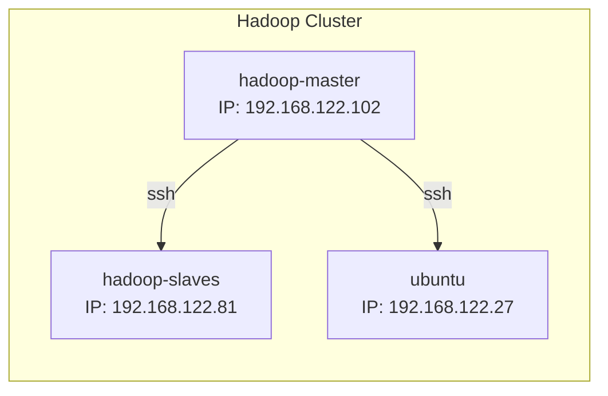
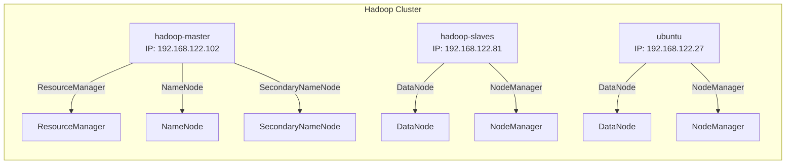

# HADOOP CLUSTER DOCUMENTATION

- [HADOOP CLUSTER DOCUMENTATION](#hadoop-cluster-documentation)
  - [1. Hadoop Introduction:](#1-hadoop-introduction)
  - [2. My Hadoop Cluster](#2-my-hadoop-cluster)
    - [2.1. Topology:](#21-topology)
    - [2.2. Cluster Operation:](#22-cluster-operation)
    - [2.3. What Hadoop Cluster can do:](#23-what-hadoop-cluster-can-do)
    - [2.4. Integration with Hive, Spark, and Oozie:](#24-integration-with-hive-spark-and-oozie)
      - [Hive:](#hive)
      - [Spark:](#spark)
      - [Oozie:](#oozie)
    - [2.5. Cooperation between Components:](#25-cooperation-between-components)
  - [3. Some example (for Hadoop only):](#3-some-example-for-hadoop-only)

## 1. Hadoop Introduction:

Apache Hadoop is an open-source software framework used for distributed storage and processing of large data sets using the MapReduce programming model. It is designed to scale up from a single server to thousands of machines, each offering local computation and storage. Hadoop provides a reliable, scalable, and efficient way to handle vast amounts of data, making it a popular choice for big data analytics.

Key components of Hadoop include:
- **Hadoop Distributed File System (HDFS)**: A distributed file system that stores data across multiple machines.
- **MapReduce**: A programming model for processing large data sets with a distributed algorithm.
- **YARN (Yet Another Resource Negotiator)**: A resource management layer for scheduling and managing cluster resources.
- **Hadoop Common**: The common utilities and libraries that support other Hadoop modules.

## 2. My Hadoop Cluster

### 2.1. Topology:

My Hadoop Cluster deployed on QEMU/KVM machines with this following spec:

- **OS**: Ubuntu server 22.04 LTS (cloud-image)
- **Memory**: 8GB
- **vCPU**: 2
- **Disk**: 50GB
- **Number of VM**: 3 (1 Namenode, 2 Datanode)

This is my Cluster topology:

### 2.2. Cluster Operation:

In my Hadoop Cluster, the roles and responsibilities of each node are as follows:

- **hadoop-master**:
    - **ResourceManager**: Manages the allocation of cluster resources and schedules jobs.
    - **NameNode**: Manages the metadata and namespace for the Hadoop Distributed File System (HDFS).
    - **SecondaryNameNode**: Performs periodic checkpoints of the HDFS metadata to prevent loss of data.

- **hadoop-slaves** and **ubuntu**:
    - **DataNode**: Stores the actual data in HDFS and handles read/write requests from clients.
    - **NodeManager**: Manages the execution of individual tasks on each node and monitors resource usage.

The interaction between these components ensures efficient data storage, processing, and resource management across the cluster.

Here is a detailed view of the processes running on each node:

### 2.3. What Hadoop Cluster can do:
The Hadoop Cluster described above is capable of efficiently storing and processing large datasets across multiple machines. With its distributed architecture, it can handle vast amounts of data by distributing the storage and computation tasks among the nodes in the cluster. The ResourceManager and NodeManagers ensure optimal resource allocation and job scheduling, while the NameNode and DataNodes manage the storage and retrieval of data in the Hadoop Distributed File System (HDFS). This setup allows for scalable and reliable big data analytics, making it suitable for tasks such as data mining, machine learning, and large-scale data processing.
### 2.4. Integration with Hive, Spark, and Oozie:

The Hadoop Cluster can be extended with additional components such as Hive, Spark, and Oozie to enhance its capabilities and provide a comprehensive big data processing and analytics platform.

#### Hive:
Apache Hive is a data warehouse infrastructure built on top of Hadoop. It allows users to query and manage large datasets stored in HDFS using a SQL-like language called HiveQL. Hive translates these queries into MapReduce jobs, making it easier for users to perform data analysis without writing complex MapReduce code.

Capabilities:
- **Data Warehousing**: Store and manage large datasets in a structured format.
- **SQL-like Queries**: Use HiveQL to perform complex queries and data analysis.
- **Integration with HDFS**: Directly query data stored in the Hadoop Distributed File System.

#### Spark:
Apache Spark is a fast and general-purpose cluster-computing system that provides an interface for programming entire clusters with implicit data parallelism and fault tolerance. Spark can run on Hadoop clusters and leverage HDFS for storage.

Capabilities:
- **In-Memory Processing**: Perform data processing tasks in memory for faster execution.
- **Advanced Analytics**: Support for machine learning, graph processing, and stream processing.
- **Integration with Hadoop**: Utilize HDFS for data storage and YARN for resource management.

#### Oozie:
Apache Oozie is a workflow scheduler system to manage Hadoop jobs. It allows users to define a sequence of jobs written in diverse languages such as MapReduce, Pig, Hive, and Spark, and manage their execution.

Capabilities:
- **Workflow Automation**: Define and manage complex job workflows.
- **Job Scheduling**: Schedule jobs to run at specific times or based on data availability.
- **Integration with Hadoop Ecosystem**: Coordinate jobs across various Hadoop components like Hive, Spark, and MapReduce.

### 2.5. Cooperation between Components:

The integration of Hive, Spark, and Oozie with the Hadoop Cluster enhances its functionality and provides a robust platform for big data processing and analytics. Here is how these components cooperate:

- **Hive and Hadoop**: Hive stores its metadata in a relational database and uses HDFS to store data. Queries written in HiveQL are converted into MapReduce jobs that run on the Hadoop cluster.
- **Spark and Hadoop**: Spark can read data from HDFS, process it in-memory, and write the results back to HDFS. It can also use YARN for resource management, allowing it to coexist with other Hadoop jobs.
- **Oozie and Hadoop**: Oozie workflows can include Hive, Spark, and MapReduce jobs, coordinating their execution and managing dependencies between them. This ensures that complex data processing pipelines can be automated and managed efficiently.

By integrating these components, the Hadoop Cluster becomes a powerful and versatile platform capable of handling a wide range of big data tasks, from data warehousing and SQL querying to advanced analytics and workflow automation.

## 3. Some example (for Hadoop only):
