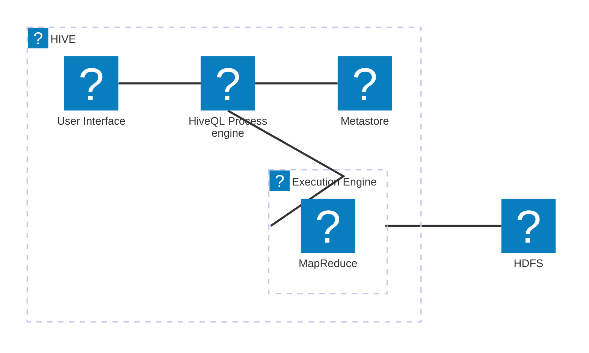
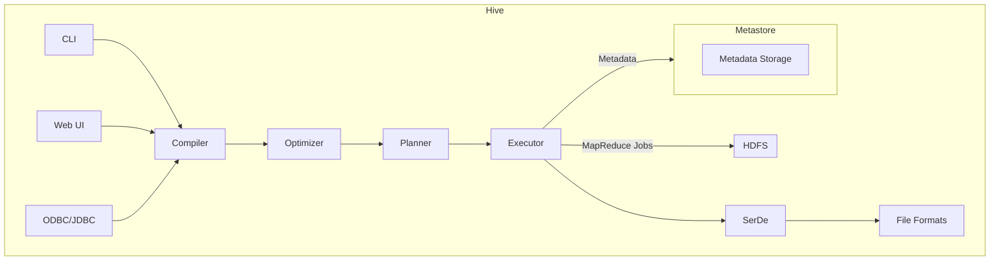

# HIVE DOCUMENTATION<!-- title: Your Title -->

**Author:** Pham Tung Lam  
**Date Released:** February 11, 2025

- [HIVE DOCUMENTATION](#hive-documentation)
  - [1. Hive Introduction:](#1-hive-introduction)
  - [2. Hive architecture overview:](#2-hive-architecture-overview)
    - [High-Level Design Architecture of Hive:](#high-level-design-architecture-of-hive)
    - [Detailed Low-Level Design Architecture of Hive:](#detailed-low-level-design-architecture-of-hive)

## 1. Hive Introduction:
Hive is a data warehouse infrastructure tool built on top of Hadoop for providing data summarization, query, and analysis. It facilitates reading, writing, and managing large datasets residing in distributed storage using SQL. Hive abstracts the complexity of Hadoop MapReduce by providing a simple SQL-like language called HiveQL.

### Main Components of Hive: <!-- omit from toc -->
- **Metastore**: Central repository for storing metadata information.
- **Driver**: Manages the lifecycle of a HiveQL statement.
- **Compiler**: Compiles HiveQL into a directed acyclic graph of MapReduce jobs.
- **Execution Engine**: Executes the tasks produced by the compiler.
- **HiveServer2**: Provides a Thrift interface and JDBC/ODBC drivers for client interactions.

### Main Purpose: <!-- omit from toc -->
Hive is designed to enable easy data summarization, ad-hoc querying, and analysis of large volumes of data. It is particularly useful for data warehousing tasks where SQL-based querying is preferred over complex MapReduce programming.

## 2. Hive architecture overview:

### High-Level Design Architecture of Hive:

Hive's architecture is designed to provide a high-level abstraction over Hadoop's MapReduce framework. The main components of Hive's architecture include:

1. **User Interface**: Allows users to submit queries and other operations to the system.
2. **MetaStore**: Stores metadata about tables, columns, partitions, and the schema.
3. **HiveQL Process Engine**: Parses, compiles, and optimizes HiveQL queries.
4. **Execution Engine**: Executes the execution plans created by the HiveQL process engine.
5. **HDFS**: Hadoop Distributed File System, where the actual data resides.
6. **MapReduce**: The underlying framework used for processing the data.



This high-level architecture allows Hive to efficiently manage and process large datasets by leveraging the distributed computing power of Hadoop.

### Detailed Low-Level Design Architecture of Hive:

The low-level design of Hive delves into the intricate details of how each component interacts and functions to provide a seamless data warehousing solution. The key components involved in the low-level architecture include:

1. **Client Interface**: This includes the command-line interface (CLI), web UI, and JDBC/ODBC drivers that allow users to interact with Hive.
2. **Compiler**: The compiler translates HiveQL statements into a directed acyclic graph (DAG) of MapReduce jobs. It performs semantic analysis and query optimization.
3. **Optimizer**: The optimizer improves the execution plan by applying various optimization techniques such as predicate pushdown, join optimization, and partition pruning.
4. **Planner**: The planner generates the physical execution plan from the optimized logical plan.
5. **Executor**: The executor is responsible for executing the physical plan by interacting with the Hadoop MapReduce framework.
6. **Metastore**: The metastore is a central repository that stores metadata about the data, such as schema information, table definitions, and partition details.
7. **SerDe**: Serializer/Deserializer (SerDe) is used for reading and writing data in a specific format.
8. **File Formats**: Hive supports various file formats such as TextFile, SequenceFile, ORC, and Parquet for storing data in HDFS.



```mermaid
architecture-beta
    group hive [hive]
    group ui [User Interface] in hive
    group hqlee [HiveQL Execution Engine] in hive
    group ee [Execution Engine] in hive
    group mtr [Metastore] in hive
    group hadoop [Hadoop Cluster]

    service cli (vscode-icons:file-type-script)


```

This detailed low-level architecture highlights the flow of data and the interaction between various components within Hive. It ensures efficient query processing, optimization, and execution, leveraging the distributed nature of Hadoop.