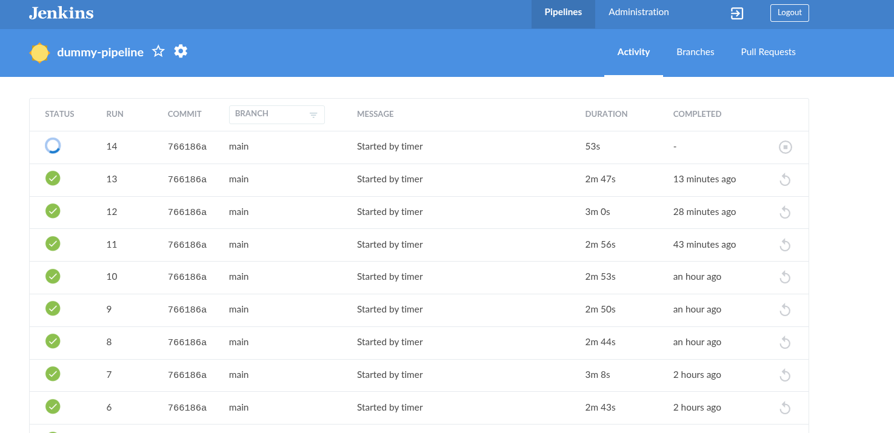
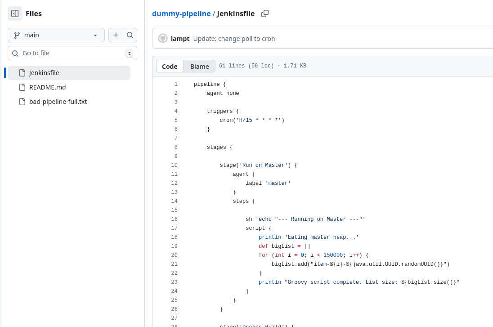
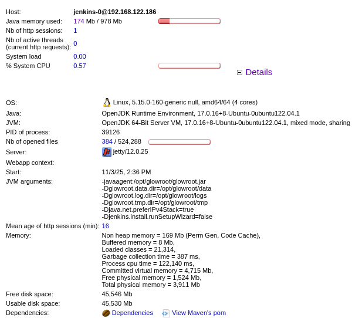
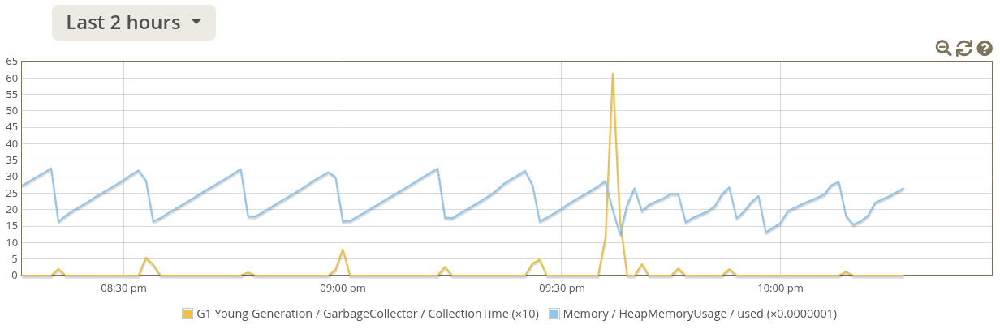
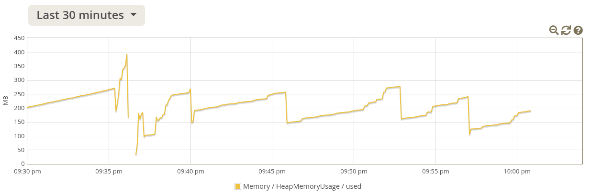
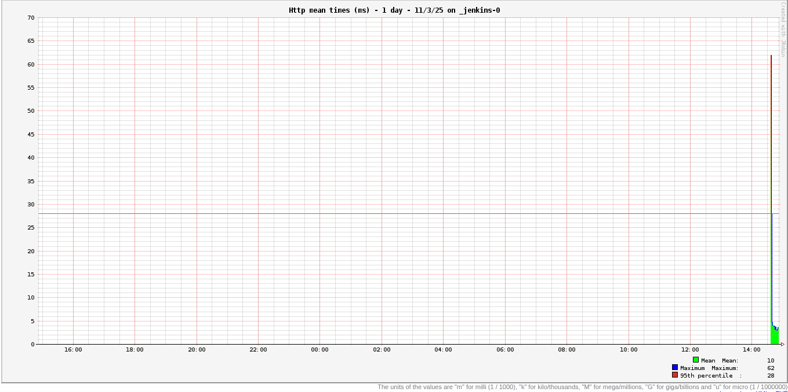
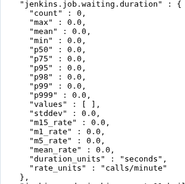
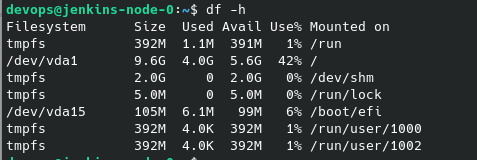

# **JENKINS**
## **OPTIMIZATION** 

###### *Presenter*: Pham Tung Lam (Alex)
---
# AGENDA

1. What that for? Do I need it?
2. Best practices or nature reflex of experiences?
3. Jenkins performance benchmark
4. Pseudo scenario

---
<!--  _class: lead  -->
# 1. What that for?

---
<!--  _header: What that for?  -->

### Let make it clear:

Jenkins is good
- It is realiable
- It is scalable
- (may be) the first CI tool ya know
- A lot of stuff (plugin) to dive in
- Quite simple DSL to learn
- Huge, professional and active community

---
<!--  _header: What that for?  -->
### Have you ever seen it struggle?

---
<!--  _class: lead  -->
# 2. Best practices or nature reflex of experiences?
---
<!--  _header: Best practices or nature reflex of experiences?  -->

### We all know a thing or two:

- Only build on agent
- Polling is not good for your health - use Webhook
- Log rotation
- History retention policy
- Backup
- Careful with scheduling (quiet period, max execution...)

---
<!--  _header: Best practices or nature reflex of experiences?  -->
<!--  _class: lead  -->
### Those are something your senior taught you.
### Do they actually have impact on Jenkins performance
### Or just to make yar work more professional
---
<!--  _class: lead  -->
# 3. Jenkins performance benchmark
---
<!--  _header: Jenkins performance benchmark  -->
### Have you ever seen :

- A Jenkins instance with hundreds or thousands of pipelines/jobs.
- A Jenkins master working with tens of agents
- A jenkins UI take seconds to response
- History scroll to the abyss
- Build take hour to complete
- Build queue pile up and PM yelling at you

---

<!--  _header: Jenkins performance benchmark  -->
### Turn out, the real bottleneck is:
1.  **JVM Heap (Master):** The silent killer. This governs UI speed, Groovy processing, and plugin capacity.
2.  **Agent Disk Space:**  Docker images, layers, and un-cleaned workspaces will fill a 6GB disk in *hours*.
3.  **Log Bloat:** It's trying to render 50,000 log lines from one build.
4.  **Artifacts:** Archiving MBs of... *stuff*... on every build.

---
<!--  _class: lead  -->
# 4. Pseudo Scenario

### *Rescuring a "stroked" Jenkins*
---
<!--  _header: Pseudo Scenario  -->
### I killed my Jenkins instance, literally!

---
<!--  _header: Pseudo Scenario  -->
### How to:

A faulty pipeline can do the trick!

---
<!--  _class: lead  -->
<!--  _header: Pseudo Scenario  -->
### Below is some fresh metric that I collected when init Jenkins 

---

<!--  _header: Pseudo Scenario  -->
### Baseline for comparing:
*System Metrics*

---
<!--  _header: Pseudo Scenario  -->
### Baseline for comparing:
*GC time*

---
<!--  _header: Pseudo Scenario  -->
### Baseline for comparing:
*Heap usage*

---
<!--  _header: Pseudo Scenario  -->
### Baseline for comparing:
*Http request meantimes*

---
<!--  _header: Pseudo Scenario  -->
### Baseline for comparing:
*Job waiting duration*

---
<!--  _header: Pseudo Scenario  -->
### Baseline for comparing:
*Agent free disk*

---
<!--  _class: lead  -->
<!--  _header: Pseudo Scenario  -->
# This is "DEMO" time!!!
*Let's rescure the poor Jenkins instance*