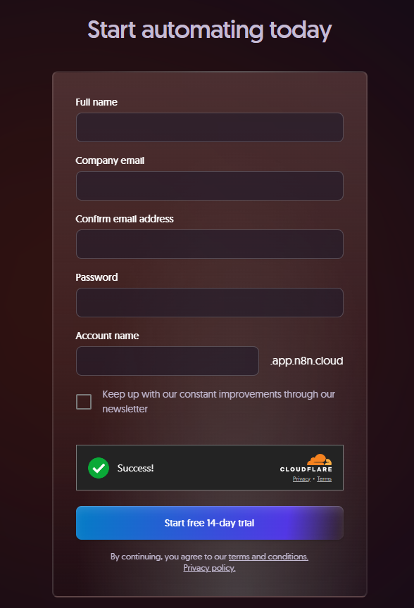
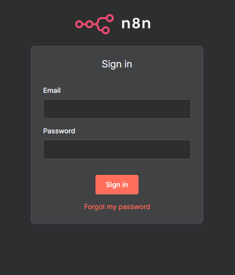
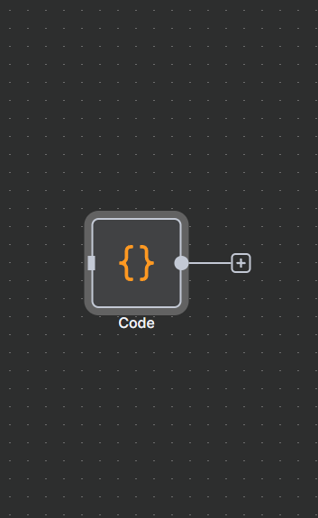
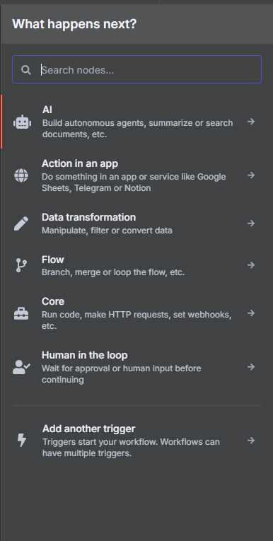
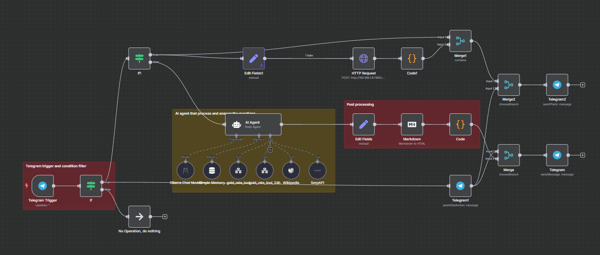
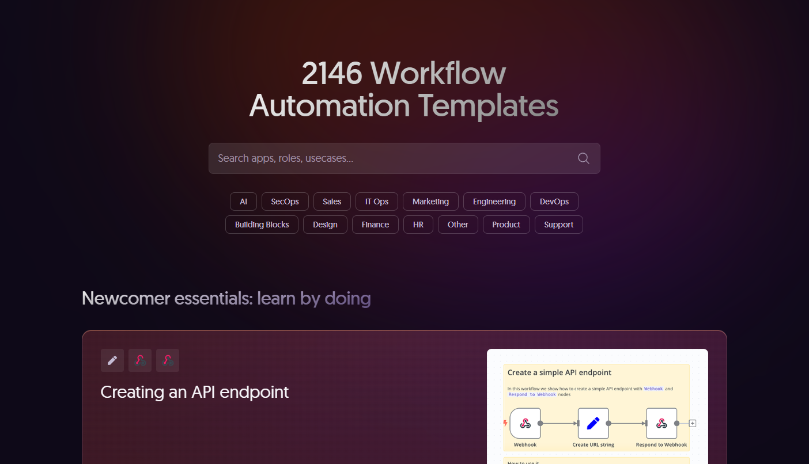
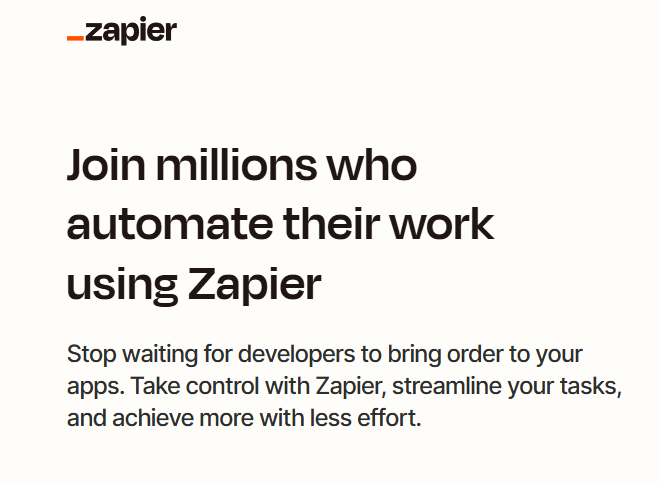
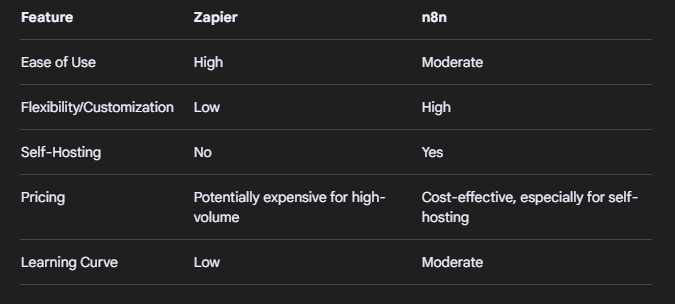
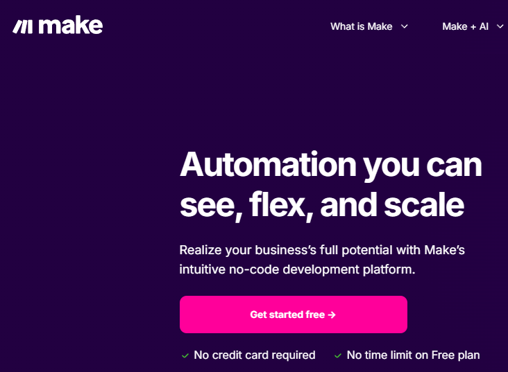
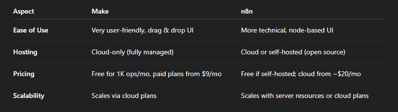

# **N8N**
## **INTRODUCTION** 

###### *Presenter*: Pham Tung Lam (Alex)

---
<!--  _class: lead  -->
# 1. What is N8N

---
<!--  _header: 1. What is N8N  -->

- Open-source (actually - a "Fair code license" meaning it's not really Open) workflow automation tool
- Connect any app with an API with any other
- Little or no code
 
_N8N means "Nodemation", "Node" in...Node, and "mation" in Automation_

---
<!--  _class: lead  -->
# 2. Platform

---
<!--  _header: 2. Platform  -->

## N8N Cloud:
n8n Cloud is n8n's hosted solution. It provides:
- No technical set up or maintenance for your n8n instance
- Continual uptime monitoring
- Managed OAuth for authentication
- One-click upgrades to the newest n8n versions

---
<!--  _header: 2. Platform  -->

## Self-host:
n8n can be self-hosted by 2 ways:
- npm
- Docker

---
<!--  _class: lead  -->
# 3. How it works
 

_Unfortunatly, I don't know how it work under the hood_

---
<!--  _header: 3. How it works  -->
#### Base on what I know and found out when using N8N:
- N8N based on Javascript
- Have a large collection of APIs of many system
- Have a built-in SQLite DB for store workflow metadata and manifest, user data,etc...
- Can be deployed in Regular (single) Mode or Queue (master-worker) mode for higher workload capability.

---

<!--  _header: 3. How it works  -->

#### Nodes:
- Base component of N8N.
- Each node have own purpose
- Have many node categories, serve many kind of need
- All Nodes are designed with ideal of No-Low code.
- Community can make custom node and import into N8N.

---
<!--  _header: 3. How it works  -->

#### Nodes categories:
- Nodes are grouped into categories base on their functionality

---

<!--  _header: 3. How it works  -->

#### Workflow:
- A group of Nodes that links and works with each other to achive a final goal, form a **Workflow**.
- a Workflow always have a **trigger node** that mark the start of a **Execution** and receive the first input for the workflow

---

<!--  _header: 3. How it works  -->

#### Workflow templates:
- N8N have a huge community.
- [N8N workflow templates repository](https://n8n.io/workflows/) have over 2000 workflows that made and tested by the community, ready to use.
- N8N templates are also grouped by Categories and Tags, and it have "Devops"

---
<!--  _class: lead  -->
# 4. Who is it for?

---

<!--  _header: 4. Who is it for?  -->

### Non-tech user:

- They can very appreciated the LOW-NO CODE principle of N8N
- It require little to no technical knowlegde, just find whatever the node want and you are all set.
- The Workflow template repository are very helpful. Anything you need and thinking of will be there, just download and import it.
- Saleman, Content Creator,... is main charater here!

---

<!--  _header: 4. Who is it for?  -->

### IT workshiper:

- Still, N8N have a node call **"CODE"** in which you can write your own code in JS or Python. Safe place to fall back in 
- Your knowledge will make you a workflow-buider master in no time. Just like a program, workflows need error handler, logical router, etc...
- Leverage N8N to do some small and repeat tasks on your behalf, which is common in your working environtment.

---

<!--  _class: lead  -->
# 5. Alternative and Competitor

---

<!--  _header: 5. Alternative and Competitor  -->

### 1. [Zapier](https://zapier.com/):

- **Ease of Use**:
Zapier is designed to be user-friendly, with a drag-and-drop interface and pre-built integrations for a wide range of apps. 
- **Cloud-Based**:
Zapier is a cloud-based service, meaning you don't need to worry about server management. 

---

<!--  _header: 5. Alternative and Competitor  -->

### 1. [Zapier](https://zapier.com/):
- **Pricing**:
Zapier's pricing can become expensive as your automations grow, especially if you need to run a large number of tasks. 
- **Scalability**:
Zapier offers good scalability, but it may not be the most cost-effective option for high-volume processing. 

---

<!--  _header: 5. Alternative and Competitor  -->
### Zapier vs N8N:

---

<!--  _header: 5. Alternative and Competitor  -->

### 2. Make:

###### _Not that "Make"_
- **Ease of Use**:
Make.com provides a polished, highly visual workflow builder. 
- **Cloud-Based**:
 Make is delivered exclusively as a cloud SaaS. 

---

<!--  _header: 5. Alternative and Competitor  -->

### 2. Make:

###### _Not that "Make"_
- **Pricing**:
Make uses a pay-per-operation model. Each step in a workflow counts as one “operation” towards usage 
- **Scalability**:
Make runs on a multi-zone, enterprise-grade cloud infrastructure

---

<!--  _header: 5. Alternative and Competitor  -->
### Make vs N8N:

---

<!--  _class: lead  -->
# 6. Demo

 

_K8S Telegram AI chatbot_